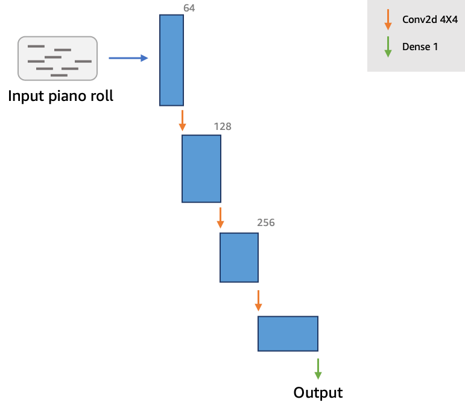

# Python tricks used

Using numpy or data structures is more efficient than writing own loops.

1. Find common elements between 2 lists

   1. Using **numpy intersection**

   ```py
   np.intersect1d(recent_books, coding_books)
   ```

   2. Using **set intersection**

   ```py
   set(recent_books).intersection(set(coding_books)) #convert lists to sets
   ```

2. Select elements from array which meet certain condition

   ```py
   gift_array = np.array(gift_costs) #convert list to array
   gift_array = gift_array[gift_array < 25]
   ```

3. Find sum of elements in array

```py
sum = np.sum(gift_array)
```

4. Magic methods: They change default behavior of python operations. They begin and end with '**'. Eg. `**init**`,`**add\*\*`,`**repr**` etc.

```py
class Gaussian():
   def __add__(self, other):
      result = Gaussian()
      result.mean = self.mean + other.mean
      result.stdev = math.sqrt(self.stdev**2 + other.stdev**2)

      return result

gaussian_one = Gaussian(25, 3)
gaussian_two = Gaussian(30, 4)
gaussian_sum = gaussian_one + gaussian_two # Using __add__ magic method

```

# Creating custom packages

[gaussian_project](/gaussian_project) contains custom package. Package code is in /distributions. There are 2 special files, `setup.py` and `/distributions/__init__.py`.

1. Update import statements.

In Gaussiandistribution.py

```py
from .Generaldistribution import Distribution
```

2. Create `distributions/__init__.py`. It tells which modules the package must import.

```py
from .Gaussiandistribution import Gaussian
```

3. Create `setup.py` and paste template

```py
import setuptools

setuptools.setup(
    name="distributions",
    version="0.1",
    description="Gaussian distribution",
    packages=setuptools.find_packages(),
)
```

4. Create venv and install this package

```sh
python -m venv venv
source venv/bin/activate
pip install gaussian_project/.
python gaussian.py
```

# AL and ML basics

Machine learning is a subset of AI. It broadly has 3 techniques:

1. Supervised learning: uses labelled data for training.
2. Unsupervised learning: No labelling.
3. Reinforcement learning: Learns through positive/negative feedback from environment.

# AWS DeepComposer piano

- Uses Generative Adverserial Network(GAN), a type of unsupervised learning. It pits 2 neural networks against each other to produce new works from provided inputs. They are trained in alternate cycles.

  1.  Generator: Produces new data. It can be thought of as the orchestra.
  2.  Discriminator: Trained using input data. It distinguishes between the input data and generated data. Judges output created by generator and provides feedback to improve it. It can be thought of as the conductor.

  Generator and discriminator are both **convolutional neural networks(CNNs)**.

- After every epoch, a loss function each is calculated for the generator and discriminator. Initially values fluctuate. Finally they **converge** and training stops.

  

- **Similarity Index**: Measures how close is the generated output to the provided input. It moves towards 0. When it smoothens out, we can say that the model is converging.

- **Supports 2 algorithms**: MuseGAN and U-Net.

- Working

  - Treats music as a series of images and applies image processing methods.
  - Time is in X axis and pitch in Y axis.

  

## U-Net architecture

### Generator


- It has the **encoder** on left side and **decoder** on the right, forming a _U shape_.
- Encoder takes 2 inputs
  1.  Single track piano roll
  2.  Noise vector: Provides unique flavor to produced output even if same piano roll is provided.
- Encoder converts input to a lower dimensional **latent space**.
- Decoder converts this to output piano roll

### Discriminator / critic



- Outputs a scalar value telling the generator how 'real' or 'fake' was the produced output.
- Made of 4 convolutional layers and a dense layer in the end.

## Custom models

Besides selecting MuseGAN or U-Net, we can fine tune the model using hyperparameters:

1. Number of epochs: More epochs means better quality but more time to train.
2. Learning rate: How rapidly weights and biases are updated. Higher learning rate allows us to explore more weights, but the model may pass over the optimal weights.
3. Update ratio: Number of times discriminator weights are updated per epoch. Increasing this can allow generator to learn more quickly early on, but will increase overall training time.

## Inference

This is the process to produce output music from trained generator.

1. Pass sample roll and noise to generator.
2. Trained generator model produces multiple output rolls.
3. Convert output into MIDI format. Assign eac output roll to a different instrument.
